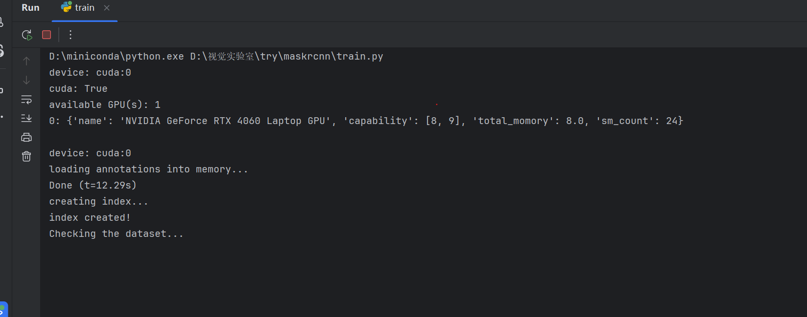

train.py是是一个用于训练 Mask R-CNN 模型的脚本。
1. 在E盘创建对应的目录，指令如下
mkdir -p E:/PyTorch/data/coco2017/annotations
mkdir -p E:/PyTorch/data/coco2017/train2017
mkdir -p E:/PyTorch/data/coco2017/val2017
2. 下载COCO数据集，指令如下
# 下载 `2017 Train images [118K/18GB]` 到 `E:/PyTorch/data/coco2017/train2017`
curl -o E:/PyTorch/data/coco2017/train2017.zip http://images.cocodataset.org/zips/train2017.zip
unzip E:/PyTorch/data/coco2017/train2017.zip -d E:/PyTorch/data/coco2017/train2017

# 下载 `2017 Val images [5K/1GB]` 到 `E:/PyTorch/data/coco2017/val2017`
curl -o E:/PyTorch/data/coco2017/val2017.zip http://images.cocodataset.org/zips/val2017.zip
unzip E:/PyTorch/data/coco2017/val2017.zip -d E:/PyTorch/data/coco2017/val2017

# 下载 `2017 Train/Val annotations [241MB]` 到 `E:/PyTorch/data/coco2017/annotations`
curl -o E:/PyTorch/data/coco2017/annotations/annotations_trainval2017.zip http://images.cocodataset.org/annotations/annotations_trainval2017.zip
unzip E:/PyTorch/data/coco2017/annotations/annotations_trainval2017.zip -d E:/PyTorch/data/coco2017/annotations
3. 压缩文件如下
```
coco2017/
    annotations/
        instances_train2017.json
        instances_val2017.json
        ...
    train2017/
        000000000009.jpg
        ...
    val2017/
        000000000139.jpg
        ...
```
4. 运行训练脚本

5. 训练过程中，会在`E:/PyTorch/data/coco2017`目录下生成`maskrcnn_coco.pth`文件，该文件是训练好的模型参数。
6. 列出pytorch_mask_rcnn文件夹下的文件目录，指令如下->前缀自行修改->
dir "D:\视觉实验室\try\maskrcnn\pytorch_mask_rcnn" -Recurse
7. 项目文件结构
pytorch_mask_rcnn/
├── datasets/
│   ├── __pycache__/
│   ├── coco_dataset.py-------------------->处理 COCO 数据集的加载和预处理。
│   ├── coco_eval.py----------------------->用于评估 COCO 数据集的模型性能。
│   ├── generalized_dataset.py------------->通用数据集类，用于加载和预处理数据集。
│   ├── utils.py--------------------------->数据集相关的工具函数。
│   ├── voc_dataset.py--------------------->处理 VOC 数据集的加载和预处理。
│   └── __init__.py------------------------>初始化 datasets 模块。
├── model/
│   ├── __pycache__/
│   ├── box_ops.py------------------------->包含边界框操作的函数。
│   ├── mask_rcnn.py----------------------->定义 Mask R-CNN 模型的主要结构和功能。
│   ├── pooler.py-------------------------->实现 RoI 池化操作。
│   ├── roi_heads.py----------------------->定义 RoI 头部的结构和功能。
│   ├── rpn.py----------------------------->实现区域建议网络（RPN）。
│   ├── transform.py----------------------->图像和目标的预处理和后处理。
│   ├── utils.py--------------------------->模型相关的工具函数。
│   └── __init__.py------------------------>初始化 model 模块。
├── __pycache__/
├── engine.py------------------------------>训练和评估的主要逻辑。
├── gpu.py--------------------------------->GPU 相关的操作和工具函数。
├── utils.py------------------------------->通用工具函数。
├── visualizer.py-------------------------->可视化工具函数。
└── __init__.py---------------------------->初始化 pytorch_mask_rcnn 模块。
8. 训练模型脚本
训练模型脚本调用各个文件的流程分析
导入必要的库和模块：  
  导入torch和pytorch_mask_rcnn等库。
  pytorch_mask_rcnn模块包含了项目的所有核心功能。
定义try_gpu函数：  
  检查是否有可用的GPU，如果有则返回GPU设备，否则返回CPU设备。
定义main函数：  
  设备设置：调用try_gpu函数设置设备。
  显示GPU信息：如果使用GPU，调用pmr.get_gpu_prop显示GPU属性。
  准备数据加载器：
    加载训练数据集和验证数据集，使用pmr.datasets函数。
    训练数据集和验证数据集分别存储在d_train和d_test中。
  设置模型和优化器：
    根据数据集的类别数量，初始化Mask R-CNN模型，使用pmr.maskrcnn_resnet50函数。
    设置优化器torch.optim.SGD。
  加载检查点：
    查找并加载最新的检查点文件，恢复模型和优化器的状态。
  训练和评估：
    迭代训练模型，调用pmr.train_one_epoch进行每个epoch的训练。
    评估模型，调用pmr.evaluate进行评估。
    保存检查点，调用pmr.save_ckpt保存模型和优化器的状态。
    删除多余的检查点文件。
主程序入口：  
  使用argparse解析命令行参数。
  调用main函数开始训练。
9. 模型层结构
### 这个模型 `MaskRCNN` 包含以下主要层：

1. **Backbone**: 用于提取图像特征的主干网络。这里使用的是 `ResBackbone`，它基于 ResNet-50。:
   - conv1: 卷积层
   - bn1: 批归一化层
   - relu: 激活函数
   - maxpool: 最大池化层
   - layer1 至 layer4: 残差块
2. **RPN (Region Proposal Network)**: 区域建议网络，用于生成候选区域。
   - `AnchorGenerator`: 生成锚点。
   - `RPNHead`: RPN 的头部，包含卷积层。
       - onv: 卷积层 
       - cls_logits: 分类卷积层 
       - bbox_pred: 边界框回归卷积层
   - `RegionProposalNetwork`: 结合锚点生成器和 RPN 头部，生成候选区域。
       - AnchorGenerator 
       - RPNHead

3. **RoIHeads**: 用于处理 RPN 生成的候选区域。
   - `RoIAlign`: 用于对齐候选区域的特征。
   - `FastRCNNPredictor`: 用于分类和边界框回归的预测器。
       - cls_score: 全连接层 
       - bbox_pred: 全连接层
   - `MaskRCNNPredictor`: 用于生成分割掩码的预测器。
       - conv5_mask: 卷积层 
       - mask_fcn_logits: 卷积层

4. **Transformer**: 用于图像预处理和后处理。
   - `Transformer`: 包含图像的缩放、归一化等操作。
       - resize: 缩放操作 
       - normalize: 归一化操作

5. **其他辅助层**:
   - `nn.Conv2d`, `nn.Linear`, `nn.ReLU`, `nn.ConvTranspose2d`: 用于构建各个子模块的卷积层、全连接层和激活函数。
   - nn.Conv2d: 卷积层 
   - nn.Linear: 全连接层 
   - nn.ReLU: 激活函数 
   - nn.ConvTranspose2d: 转置卷积层

这些层共同构成了 Mask R-CNN 模型，用于目标检测和实例分割任务。
10. 打印模型结构

MaskRCNN(
  (backbone): ResBackbone(
    (body): ModuleDict(
      (conv1): Conv2d(3, 64, kernel_size=(7, 7), stride=(2, 2), padding=(3, 3), bias=False)
      (bn1): FrozenBatchNorm2d(64, eps=1e-05)
      (relu): ReLU(inplace=True)
      (maxpool): MaxPool2d(kernel_size=3, stride=2, padding=1, dilation=1, ceil_mode=False)
      (layer1): Sequential(
        (0): Bottleneck(
          (conv1): Conv2d(64, 64, kernel_size=(1, 1), stride=(1, 1), bias=False)
          (bn1): FrozenBatchNorm2d(64, eps=1e-05)
          (conv2): Conv2d(64, 64, kernel_size=(3, 3), stride=(1, 1), padding=(1, 1), bias=False)
          (bn2): FrozenBatchNorm2d(64, eps=1e-05)
          (conv3): Conv2d(64, 256, kernel_size=(1, 1), stride=(1, 1), bias=False)
          (bn3): FrozenBatchNorm2d(256, eps=1e-05)
          (relu): ReLU(inplace=True)
          (downsample): Sequential(
            (0): Conv2d(64, 256, kernel_size=(1, 1), stride=(1, 1), bias=False)
            (1): FrozenBatchNorm2d(256, eps=1e-05)
          )
        )
        (1): Bottleneck(
          (conv1): Conv2d(256, 64, kernel_size=(1, 1), stride=(1, 1), bias=False)
          (bn1): FrozenBatchNorm2d(64, eps=1e-05)
          (conv2): Conv2d(64, 64, kernel_size=(3, 3), stride=(1, 1), padding=(1, 1), bias=False)
          (bn2): FrozenBatchNorm2d(64, eps=1e-05)
          (conv3): Conv2d(64, 256, kernel_size=(1, 1), stride=(1, 1), bias=False)
          (bn3): FrozenBatchNorm2d(256, eps=1e-05)
          (relu): ReLU(inplace=True)
        )
        (2): Bottleneck(
          (conv1): Conv2d(256, 64, kernel_size=(1, 1), stride=(1, 1), bias=False)
          (bn1): FrozenBatchNorm2d(64, eps=1e-05)
          (conv2): Conv2d(64, 64, kernel_size=(3, 3), stride=(1, 1), padding=(1, 1), bias=False)
          (bn2): FrozenBatchNorm2d(64, eps=1e-05)
          (conv3): Conv2d(64, 256, kernel_size=(1, 1), stride=(1, 1), bias=False)
          (bn3): FrozenBatchNorm2d(256, eps=1e-05)
          (relu): ReLU(inplace=True)
        )
      )
      (layer2): Sequential(
        (0): Bottleneck(
          (conv1): Conv2d(256, 128, kernel_size=(1, 1), stride=(1, 1), bias=False)
          (bn1): FrozenBatchNorm2d(128, eps=1e-05)
          (conv2): Conv2d(128, 128, kernel_size=(3, 3), stride=(2, 2), padding=(1, 1), bias=False)
          (bn2): FrozenBatchNorm2d(128, eps=1e-05)
          (conv3): Conv2d(128, 512, kernel_size=(1, 1), stride=(1, 1), bias=False)
          (bn3): FrozenBatchNorm2d(512, eps=1e-05)
          (relu): ReLU(inplace=True)
          (downsample): Sequential(
            (0): Conv2d(256, 512, kernel_size=(1, 1), stride=(2, 2), bias=False)
            (1): FrozenBatchNorm2d(512, eps=1e-05)
          )
        )
        (1): Bottleneck(
          (conv1): Conv2d(512, 128, kernel_size=(1, 1), stride=(1, 1), bias=False)
          (bn1): FrozenBatchNorm2d(128, eps=1e-05)
          (conv2): Conv2d(128, 128, kernel_size=(3, 3), stride=(1, 1), padding=(1, 1), bias=False)
          (bn2): FrozenBatchNorm2d(128, eps=1e-05)
          (conv3): Conv2d(128, 512, kernel_size=(1, 1), stride=(1, 1), bias=False)
          (bn3): FrozenBatchNorm2d(512, eps=1e-05)
          (relu): ReLU(inplace=True)
        )
        (2): Bottleneck(
          (conv1): Conv2d(512, 128, kernel_size=(1, 1), stride=(1, 1), bias=False)
          (bn1): FrozenBatchNorm2d(128, eps=1e-05)
          (conv2): Conv2d(128, 128, kernel_size=(3, 3), stride=(1, 1), padding=(1, 1), bias=False)
          (bn2): FrozenBatchNorm2d(128, eps=1e-05)
          (conv3): Conv2d(128, 512, kernel_size=(1, 1), stride=(1, 1), bias=False)
          (bn3): FrozenBatchNorm2d(512, eps=1e-05)
          (relu): ReLU(inplace=True)
        )
        (3): Bottleneck(
          (conv1): Conv2d(512, 128, kernel_size=(1, 1), stride=(1, 1), bias=False)
          (bn1): FrozenBatchNorm2d(128, eps=1e-05)
          (conv2): Conv2d(128, 128, kernel_size=(3, 3), stride=(1, 1), padding=(1, 1), bias=False)
          (bn2): FrozenBatchNorm2d(128, eps=1e-05)
          (conv3): Conv2d(128, 512, kernel_size=(1, 1), stride=(1, 1), bias=False)
          (bn3): FrozenBatchNorm2d(512, eps=1e-05)
          (relu): ReLU(inplace=True)
        )
      )
      (layer3): Sequential(
        (0): Bottleneck(
          (conv1): Conv2d(512, 256, kernel_size=(1, 1), stride=(1, 1), bias=False)
          (bn1): FrozenBatchNorm2d(256, eps=1e-05)
          (conv2): Conv2d(256, 256, kernel_size=(3, 3), stride=(2, 2), padding=(1, 1), bias=False)
          (bn2): FrozenBatchNorm2d(256, eps=1e-05)
          (conv3): Conv2d(256, 1024, kernel_size=(1, 1), stride=(1, 1), bias=False)
          (bn3): FrozenBatchNorm2d(1024, eps=1e-05)
          (relu): ReLU(inplace=True)
          (downsample): Sequential(
            (0): Conv2d(512, 1024, kernel_size=(1, 1), stride=(2, 2), bias=False)
            (1): FrozenBatchNorm2d(1024, eps=1e-05)
          )
        )
        (1): Bottleneck(
          (conv1): Conv2d(1024, 256, kernel_size=(1, 1), stride=(1, 1), bias=False)
          (bn1): FrozenBatchNorm2d(256, eps=1e-05)
          (conv2): Conv2d(256, 256, kernel_size=(3, 3), stride=(1, 1), padding=(1, 1), bias=False)
          (bn2): FrozenBatchNorm2d(256, eps=1e-05)
          (conv3): Conv2d(256, 1024, kernel_size=(1, 1), stride=(1, 1), bias=False)
          (bn3): FrozenBatchNorm2d(1024, eps=1e-05)
          (relu): ReLU(inplace=True)
        )
        (2): Bottleneck(
          (conv1): Conv2d(1024, 256, kernel_size=(1, 1), stride=(1, 1), bias=False)
          (bn1): FrozenBatchNorm2d(256, eps=1e-05)
          (conv2): Conv2d(256, 256, kernel_size=(3, 3), stride=(1, 1), padding=(1, 1), bias=False)
          (bn2): FrozenBatchNorm2d(256, eps=1e-05)
          (conv3): Conv2d(256, 1024, kernel_size=(1, 1), stride=(1, 1), bias=False)
          (bn3): FrozenBatchNorm2d(1024, eps=1e-05)
          (relu): ReLU(inplace=True)
        )
        (3): Bottleneck(
          (conv1): Conv2d(1024, 256, kernel_size=(1, 1), stride=(1, 1), bias=False)
          (bn1): FrozenBatchNorm2d(256, eps=1e-05)
          (conv2): Conv2d(256, 256, kernel_size=(3, 3), stride=(1, 1), padding=(1, 1), bias=False)
          (bn2): FrozenBatchNorm2d(256, eps=1e-05)
          (conv3): Conv2d(256, 1024, kernel_size=(1, 1), stride=(1, 1), bias=False)
          (bn3): FrozenBatchNorm2d(1024, eps=1e-05)
          (relu): ReLU(inplace=True)
        )
        (4): Bottleneck(
          (conv1): Conv2d(1024, 256, kernel_size=(1, 1), stride=(1, 1), bias=False)
          (bn1): FrozenBatchNorm2d(256, eps=1e-05)
          (conv2): Conv2d(256, 256, kernel_size=(3, 3), stride=(1, 1), padding=(1, 1), bias=False)
          (bn2): FrozenBatchNorm2d(256, eps=1e-05)
          (conv3): Conv2d(256, 1024, kernel_size=(1, 1), stride=(1, 1), bias=False)
          (bn3): FrozenBatchNorm2d(1024, eps=1e-05)
          (relu): ReLU(inplace=True)
        )
        (5): Bottleneck(
          (conv1): Conv2d(1024, 256, kernel_size=(1, 1), stride=(1, 1), bias=False)
          (bn1): FrozenBatchNorm2d(256, eps=1e-05)
          (conv2): Conv2d(256, 256, kernel_size=(3, 3), stride=(1, 1), padding=(1, 1), bias=False)
          (bn2): FrozenBatchNorm2d(256, eps=1e-05)
          (conv3): Conv2d(256, 1024, kernel_size=(1, 1), stride=(1, 1), bias=False)
          (bn3): FrozenBatchNorm2d(1024, eps=1e-05)
          (relu): ReLU(inplace=True)
        )
      )
      (layer4): Sequential(
        (0): Bottleneck(
          (conv1): Conv2d(1024, 512, kernel_size=(1, 1), stride=(1, 1), bias=False)
          (bn1): FrozenBatchNorm2d(512, eps=1e-05)
          (conv2): Conv2d(512, 512, kernel_size=(3, 3), stride=(2, 2), padding=(1, 1), bias=False)
          (bn2): FrozenBatchNorm2d(512, eps=1e-05)
          (conv3): Conv2d(512, 2048, kernel_size=(1, 1), stride=(1, 1), bias=False)
          (bn3): FrozenBatchNorm2d(2048, eps=1e-05)
          (relu): ReLU(inplace=True)
          (downsample): Sequential(
            (0): Conv2d(1024, 2048, kernel_size=(1, 1), stride=(2, 2), bias=False)
            (1): FrozenBatchNorm2d(2048, eps=1e-05)
          )
        )
        (1): Bottleneck(
          (conv1): Conv2d(2048, 512, kernel_size=(1, 1), stride=(1, 1), bias=False)
          (bn1): FrozenBatchNorm2d(512, eps=1e-05)
          (conv2): Conv2d(512, 512, kernel_size=(3, 3), stride=(1, 1), padding=(1, 1), bias=False)
          (bn2): FrozenBatchNorm2d(512, eps=1e-05)
          (conv3): Conv2d(512, 2048, kernel_size=(1, 1), stride=(1, 1), bias=False)
          (bn3): FrozenBatchNorm2d(2048, eps=1e-05)
          (relu): ReLU(inplace=True)
        )
        (2): Bottleneck(
          (conv1): Conv2d(2048, 512, kernel_size=(1, 1), stride=(1, 1), bias=False)
          (bn1): FrozenBatchNorm2d(512, eps=1e-05)
          (conv2): Conv2d(512, 512, kernel_size=(3, 3), stride=(1, 1), padding=(1, 1), bias=False)
          (bn2): FrozenBatchNorm2d(512, eps=1e-05)
          (conv3): Conv2d(512, 2048, kernel_size=(1, 1), stride=(1, 1), bias=False)
          (bn3): FrozenBatchNorm2d(2048, eps=1e-05)
          (relu): ReLU(inplace=True)
        )
      )
    )
    (inner_block_module): Conv2d(2048, 256, kernel_size=(1, 1), stride=(1, 1))
    (layer_block_module): Conv2d(256, 256, kernel_size=(3, 3), stride=(1, 1), padding=(1, 1))
  )
  (rpn): RegionProposalNetwork(
    (head): RPNHead(
      (conv): Conv2d(256, 256, kernel_size=(3, 3), stride=(1, 1), padding=(1, 1))
      (cls_logits): Conv2d(256, 9, kernel_size=(1, 1), stride=(1, 1))
      (bbox_pred): Conv2d(256, 36, kernel_size=(1, 1), stride=(1, 1))
    )
  )
  (head): RoIHeads(
    (box_predictor): FastRCNNPredictor(
      (fc1): Linear(in_features=12544, out_features=1024, bias=True)
      (fc2): Linear(in_features=1024, out_features=1024, bias=True)
      (cls_score): Linear(in_features=1024, out_features=91, bias=True)
      (bbox_pred): Linear(in_features=1024, out_features=364, bias=True)
    )
    (mask_predictor): MaskRCNNPredictor(
      (mask_fcn1): Conv2d(256, 256, kernel_size=(3, 3), stride=(1, 1), padding=(1, 1))
      (relu1): ReLU(inplace=True)
      (mask_fcn2): Conv2d(256, 256, kernel_size=(3, 3), stride=(1, 1), padding=(1, 1))
      (relu2): ReLU(inplace=True)
      (mask_fcn3): Conv2d(256, 256, kernel_size=(3, 3), stride=(1, 1), padding=(1, 1))
      (relu3): ReLU(inplace=True)
      (mask_fcn4): Conv2d(256, 256, kernel_size=(3, 3), stride=(1, 1), padding=(1, 1))
      (relu4): ReLU(inplace=True)
      (mask_conv5): ConvTranspose2d(256, 256, kernel_size=(2, 2), stride=(2, 2))
      (relu5): ReLU(inplace=True)
      (mask_fcn_logits): Conv2d(256, 91, kernel_size=(1, 1), stride=(1, 1))
    )
  )
)
11. 模型输入
在 MaskRCNN 类的 forward 方法中，输入的 image 是一个张量，表示一张图片。
虽然代码片段中只展示了单张图片的处理，但在实际训练过程中，通常会使用数据加载器（如 torch.utils.data.DataLoader）
来批量加载多张图片进行训练。  数据加载器会将多张图片打包成一个批次（batch）��然后传递给模型进行训练。
因此，虽然 forward 方法处理的是单张图片，但在训练过程中，模型会处理一个批次的多张图片。
12. maskrcnn文件
MaskRCNN 类：  
实现了 Mask R-CNN 模型。
处理输入图像并返回预测结果或损失。
FastRCNNPredictor 类：  
用于分类和边界框回归的预测器。
MaskRCNNPredictor 类：  
用于生成分割掩码的预测器。
ResBackbone 类：  
定义了基于 ResNet-50 的主干网络。
maskrcnn_resnet50 函数：
构建一个带有 ResNet-50 主干网络的 Mask R-CNN 模型。
13. 模型的输入与输出
**输入：**
- 输入图像：形状为 \[C, H, W\] 的张量，值在 0-1 范围内。
- 训练模式下的目标（可选）：包含以下字段的字典：
  - `boxes`：形状为 \[N, 4\] 的浮点张量，表示真实边界框，格式为 \[xmin, ymin, xmax, ymax\]。
  - `labels`：形状为 \[N\] 的整型张量，表示每个边界框的类别标签。
  - `masks`：形状为 \[N, H, W\] 的无符号 8 位整型张量，表示每个实例的分割二值掩码。

**输出：**
- 训练模式下：包含分类和回归损失的字典，字段包括 RPN 和 R-CNN 的损失，以及掩码损失。
- 推理模式下：包含后处理预测结果的字典，字段包括：
  - `boxes`：形状为 \[N, 4\] 的浮点张量，表示预测的边界框，格式为 \[xmin, ymin, xmax, ymax\]。
  - `labels`：形状为 \[N\] 的整型张量，表示预测的类别标签。
  - `scores`：形状为 \[N\] 的浮点张量，表示每个预测的置信度分数。
  - `masks`：形状为 \[N, H, W\] 的浮点张量，表示每个实例的预测掩码，值在 0-1 范围内。
14. 模型用途
训练后的Mask R-CNN模型可以用于图像的目标检测和实例分割。用户通过输入一张图片，经过模型的处理后，可以得到以下输出：

**边界框（boxes）**：预测的目标边界框，格式为 \[xmin, ymin, xmax, ymax\]，表示目标在图像中的位置。
**标签（labels）**：预测的目标类别标签，表示检测到的目标属于哪个类别。
**分数（scores）**：每个预测目标的置信度分数，表示���型对该预测的置信程度。
**掩码（masks）**：预测的实例分割掩码，形状为 \[N, H, W\]，表示每个实例的分割结果，值在0-1范围内。

这些输出可以帮助用户在图像中定位和识别不同的目标，并对每个目标进行精确的分割。
15. 数学原理
