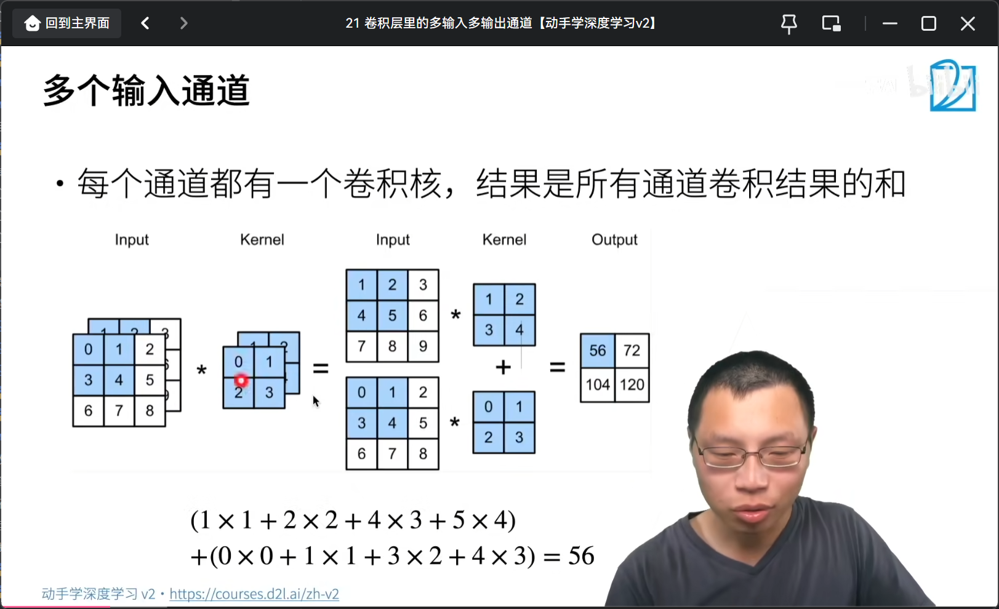
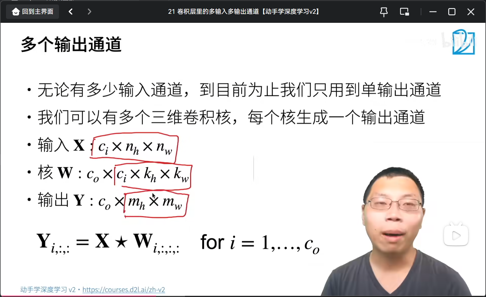
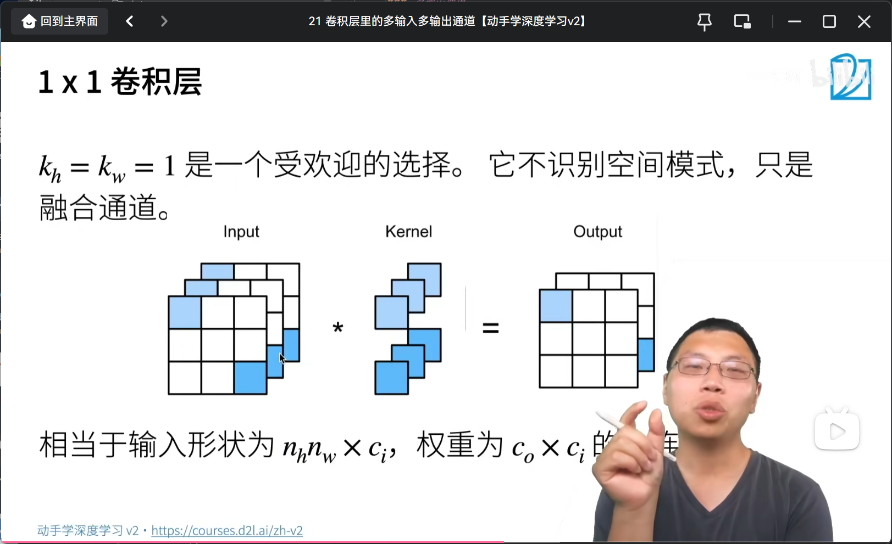
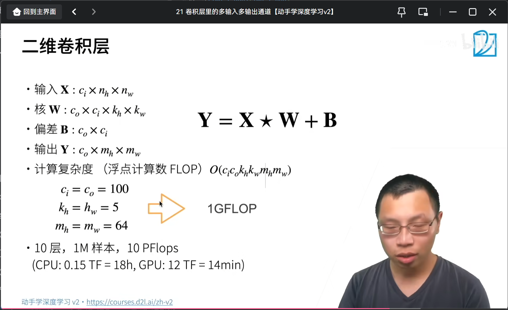

### 多输入通道

### 多输出通道

### 1*1卷积

### 二维卷积层

ci->输入通道数
nh*nw->输入的高和宽
co->输出通道数
kh*kw->卷积核的高和宽
co*ci->偏差
co*mh*mw->输出通道*输出高*输出宽
Y=X*W+B
### 计算复杂度
O(ci*co*kh*kw*mh*mw)

### 普通卷积核与1*1卷积核运算区别
### 运算流程

#### `corr2d_multi_in_out_1x1(X, K)`
1. **输入张量变形**：
   - 输入张量 `X` 形状为 `(c_i, h, w)`，其中 `c_i` 是输入通道数，`h` 是高度，`w` 是宽度。
   - 将 `X` 变形为 `(c_i, h * w)`，即每个通道的所有像素展平为一行。

2. **卷积核变形**：
   - 卷积核 `K` 形状为 `(c_o, c_i, 1, 1)`，其中 `c_o` 是输出通道数，`c_i` 是输入通道数。
   - 将 `K` 变形为 `(c_o, c_i)`，即每个输出通道对应一个输入通道的权重。

3. **矩阵乘法**：
   - 进行矩阵乘法 `Y = torch.matmul(K, X)`，得到形状为 `(c_o, h * w)` 的结果。

4. **输出张量变形**：
   - 将 `Y` 变形为 `(c_o, h, w)`，即恢复为输出张量的形状。

#### `corr2d_multi_in_out(X, K)`
1. **多输入通道二维互相关**：
   - 对于卷积核 `K` 中的每个输出通道，分别计算多输入通道的二维互相关运算。
   - 每个输出通道的卷积核 `k` 形状为 `(c_i, h_k, w_k)`，其中 `c_i` 是输入通道数，`h_k` 和 `w_k` 是卷积核的高度和宽度。

2. **二维互相关运算**：
   - 对于每个输入通道 `x` 和对应的卷积核 `k`，计算二维互相关运算 `corr2d(x, k)`。
   - 将所有结果相加，得到一个输出通道的结果。

3. **堆叠结果**：
   - 对 `K` 中每个输出通道，重复上述步骤，得到多个二维互相关结果。
   - 将所有结果堆叠在一起，形成最终的输出张量。

### 总结
- `corr2d_multi_in_out_1x1` 使用 1x1 卷积核，计算更简单，适用于全连接层的替代。
- `corr2d_multi_in_out` 使用普通卷积核，计算更复杂，适用于提取局部特征。