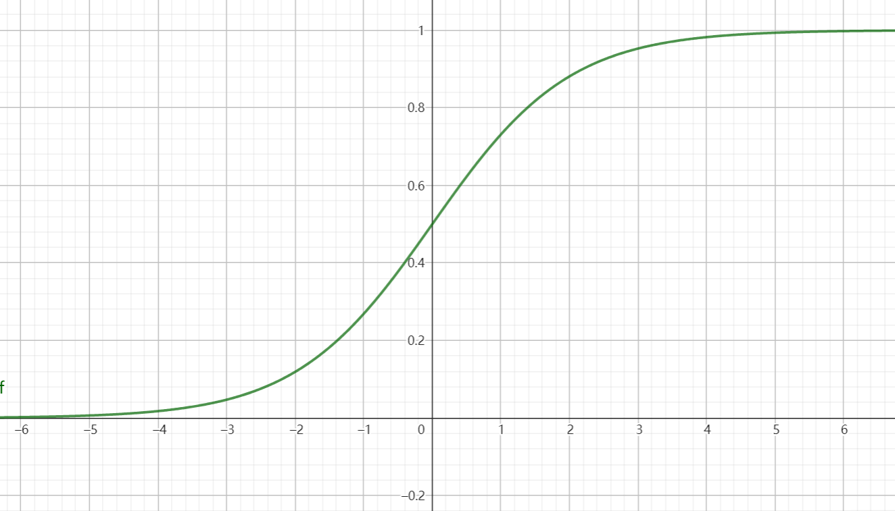
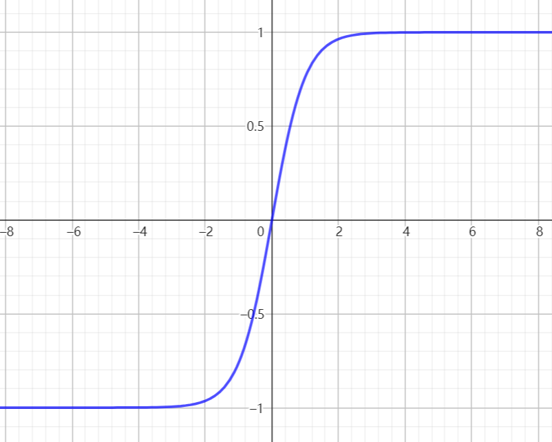

感知机是一个二分模型，求解算法等价于使用单次梯度下降，画出一个数据分割面，但是不能分类XOR函数
O X
X O
这样的数据无法单次划分
多层感知机：
   y
 O | X
— — — — x
 X | O

| 轴\数据 | 1 | 2 | 3 | 4 |
|:----:|---|---|---|---|
|  x轴  | - | + | - | + |
|  y轴  | + | + | - | - |
|  判定  | O | X | X | O |

激活函数（Activation Function）是一种非线性函数，它作用于神经元的输入，将其转换为神经元的输出。
激活函数的引入是为了给神经网络增加非线性特性，使得神经网络能够学习和表示更复杂的函数关系。函数关系。
Sigmoid 激活函数
Sigmoid（x）=1/(1+exp(-x))
    exp(-x)=e^(-x)
     ——投影到[0,1]的区间
Tanh 激活函数
Tanh（x）=(1-exp(-2x))/(1+exp(-2x))
    exp(-2x)=e^(-2x)
     ——投影到[-1,1]的区间
ReLU 激活函数
ReLU（x）=max(x,0)

多层分类
输入x->R[n] 
    这表示输入层接收一个特征向量 x，它是一个长度为 n 的实数向量。
隐藏层W1->R[m,n]  b1->R[m]
    这表示隐藏层有 m 个神经元，并且每个神经元与输入层的每个特征都有连接， 
    W1是一个 m×n 的权重矩阵,b1是隐藏层的偏置向量
h=f(W1·x+b1)
    这是隐藏层的计算过程,然后通过激活函数 f(⋅) 进行转换，得到隐藏层的输出 ℎ
    可以做多个隐藏层，上一个隐藏层输出的h作为下一个层的x
输出层W2->R[m,k]  b2->R[k]
    这表示输出层有 k 个神经元,b2是输出层的偏置向量。
o=W2 T h+b2
    这是输出层的计算过程，得到输出层的未经激活的输出o。
y=Softmax(o)
    这是应用 Softmax 激活函数的输出层。！[img.jpg](softmax.jpg)

loss = nn.CrossEntropyLoss()根据交叉熵损失函数修改权重偏置等参数

